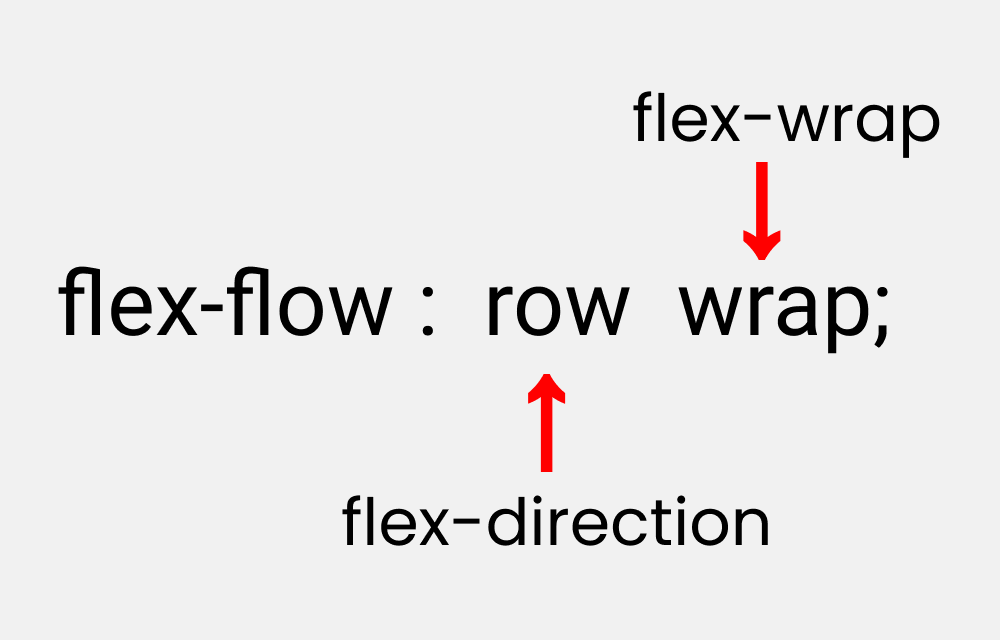
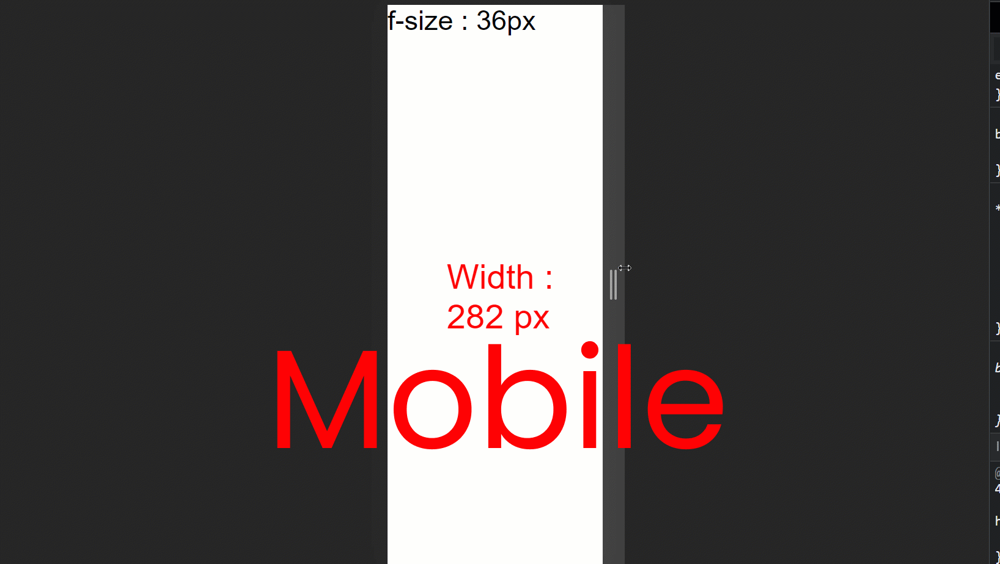
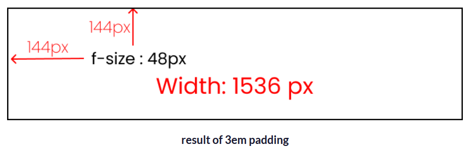
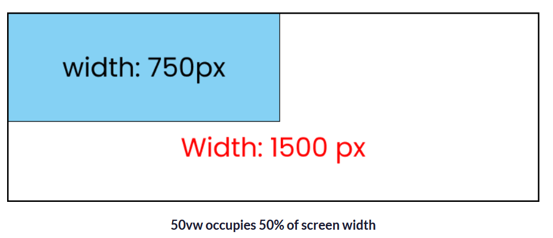
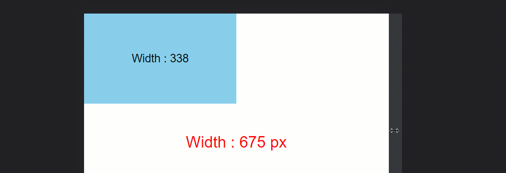
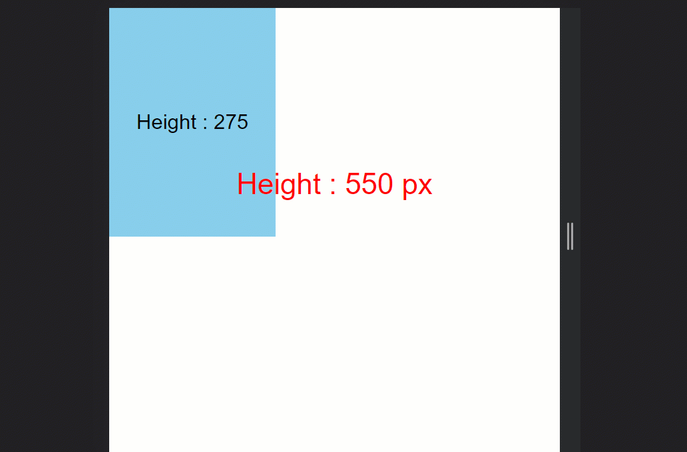

# Responsive Web Design

- [Flexbox](https://github.com/sakibcy/responsive-web-design#flexbox)
- [Css Units](https://github.com/sakibcy/responsive-web-design#css-units)
- [Css Articles](https://github.com/sakibcy/responsive-web-design#css-articles)
- [Resources From](https://github.com/sakibcy/responsive-web-design#resources-from)

## FlexBox

When you're building a house, you need a blueprint. In the same way, we need a blueprint when we're making websites. And Flexbox is the blueprint.

The Flexbox model allows us to layout the content of our website. Not only that, it helps us create the structures needed for creating responsive websites for multiple devices.

- [Flexbox Architecture](https://github.com/sakibcy/responsive-web-design#flexbox-architecture)
- [Flexbox Chart](https://github.com/sakibcy/responsive-web-design#flexbox-chart)

## Flexbox Architecture


## Flexbox Chart


## flex-direction property

This property allows us to set the direction and orientation in which our flex-items should be distributed inside the flex-container.


## flex-wrap

This property helps you set the number of flex-items you want in a line or row.


## flex-flow

This is the shorthand for the flex-direction and flex-wrap properties:



## justify-content property

This property arranges flex-items along the MAIN AXIS inside the flex-container.


## align-content property

This property arranges flex-items along the CROSS AXIS inside the flex-container. This is similar to justify-content.
Please note that without the `flex-wrap` property, this property doesn't work. Here's a demo:


## place-content

This is the shorthand for the align-content and justify-content properties:


## align-items property

This property distributes Flex-items along the `Cross Axis`.


## align-self property

This property works on the child classes. It positions the selected item along the Cross Axis.

In total we have 6 values:

- flex-start
- flex-end
- center
- baseline
- stretch
- auto

## The order property

In addition to reversing the order in which flex items are visually displayed, you can target individual items and change where they appear in the visual order with the `order` property.

The `order` property is designed to lay the items out in ordinal groups. What this means is that items are assigned an integer that represents their group. The items are then placed in the visual order according to that integer, lowest values first. If more than one item has the same integer value, then within that group the items are laid out as per source order.

As an example, I have 5 flex items, and assign order values as follows:

- Source item 1: order: 2
- Source item 2: order: 3
- Source item 3: order: 1
- Source item 4: order: 3
- Source item 5: order: 1

These items would be displayed on the page in the following order:

- Source item 3: order: 1
- Source item 5: order: 1
- Source item 1: order: 2
- Source item 2: order: 3
- Source item 4: order: 3

Items have a number showing their source order which has been rearranged.


You can play around with the values in this live example below and see how that changes the order. Also, try changing flex-direction to row-reverse and see what happens — the start line is switched so the ordering begins from the opposite side.

## gap (grid-gap)

The gap CSS property sets the gaps (gutters) between rows and columns. It is a shorthand for row-gap and column-gap.


## flex - grow | shrink | wrap | basis properties

The properties will work when we resize the window.

## flex-grow

This property grows the size of a flex-item based on the width of the flex-container.

## flex-shrink

This property helps a flex item shrink based on the width of the flex-container. It's the opposite of flex-grow.


Please note that flex-grow and flex-shrink work on child classes. So, we will target all our boxes like this:

```css
.box-1 {
  flex-grow: 1;
}
.box-2 {
  flex-grow: 5;
}
.box-1 {
  flex-grow: 1;
}
```

## flex-basis

This is similar to adding width to a flex-item, but only more flexible. flex-basis: 10em, for example, will set the initial size of a flex-item to 10em. Its final size will be based on the available space, flex-grow, and flex-shrink.

## flex shorthand

This is the shorthand for the flex-grow, flex-shrink and flex-basis properties combined.


## Css Units

## REM, EM, VW, VH are relative units

### Font using the REM unit



## pixels are absolute units.

👇 Notice that the font size of 50px doesn't change when we resize the window.


## REM Unit

The REM unit depends on the `root element [the HTML element]`. Here's an image to show you how it works:👇


## How to change the root font-size

By default `root fon-size` is `16px`. But you can change it 👇

```css
html {
  font-size: 40px; /* Change here */
}

.text {
  font-size: 1rem;
}
```

## How to Make Responsive Websites with REM Units

Write your styles in rem units instead of the pixels and change the root elements at different breakpoints using media queries.

```css
// large screen

@media (max-width: 1400px) {
  html {
    font-size: 25px;
  }
}

// Tablet screen

@media (max-width: 768px) {
  html {
    font-size: 18px;
  }
}

// Mobile screen

@media (max-width: 450px) {
  html {
    font-size: 12px;
  }
}
```

### Now, set the .text class to 3 rem units, like this:

```css
.text {
  font-size: 3rem;
}
```

And here's the result: 👇


Here are the calculations:

- For the large screen -> 3 rem \* 25px = 75px
- For tablet screen -> 3 rem \* 18px = 54px
- For mobile screen -> 3 rem \* 12px = 36px
- Default setting -> 3rem \* 16px = 48px

## EM Units

### Don't use the EM unit 😵❌

Using the EM unit is not worth the effort because:

- you have a high chance of making a calculation error
- you have to write a lot of code in media queries while trying to make the website responsive on all screen sizes
- it's too time-consuming.

The EM unit is the same as the REM unit but it depends on the parent font size. Here's a demo. 👇

Note: make sure you remove all the media queries.

```css
html {
  font-size: 16px;
}

.text {
  font-size: 3em;
}

/** Calculations
  font-size should be 
  3 em * 16px = 48px
**/
```

Now, let's try adding 3em padding to the .text class.

```css
html {
  font-size: 16px;
}

.text {
  font-size: 3em;
  padding: 3em;
}

/** Calculations
text    => 3em * 16px = 48px
padding => 3em * 3em * 16px = 144px
**/
```

Instead of being 48px of padding, we are getting 144px padding. As you can see, it is getting multiplied by the previous number.



Here's the computed part from the developer console: 👇


## VW unit - viewport width

It works like the percentage unit. Specifying `50vw` is equivalent to occupying `50% of entire visible screen width`

```css
.text {
  display: none;
}

.box {
  width: 50vw;

  height: 300px;
  /* display: none; */
}
```

If you look carefully, you can see that 50vw means 50%, which will cover half of the entire screen width.



resizing box which is 50vw in size. It is taking 50% of entire screen even if we resize the window.



## VH unit - viewport height

It works like the percentage unit as well. Specifying `50vh` is equivalent to `occupying 50% of entire visible screen height`

```css
.text {
  display: none;
}

.box {
  width: 300px;

  height: 50vh;
  /* display: none; */
}
```

And here's the result: 👇


As you can see, it will always cover that much space even if we resize the window.



## Css Articles

- [Learn CSS Units – Em, Rem, VH, and VW with Code Examples ✨✨](https://www.freecodecamp.org/news/learn-css-units-em-rem-vh-vw-with-code-examples/)
- [Flexbox Tutorial with Flexbox Properties Cheat Sheet 🎖️](https://www.freecodecamp.org/news/css-flexbox-tutorial-with-cheatsheet/)

## Resources from

- [Joy Shahed](https://www.freecodecamp.org/news/author/joy/)
