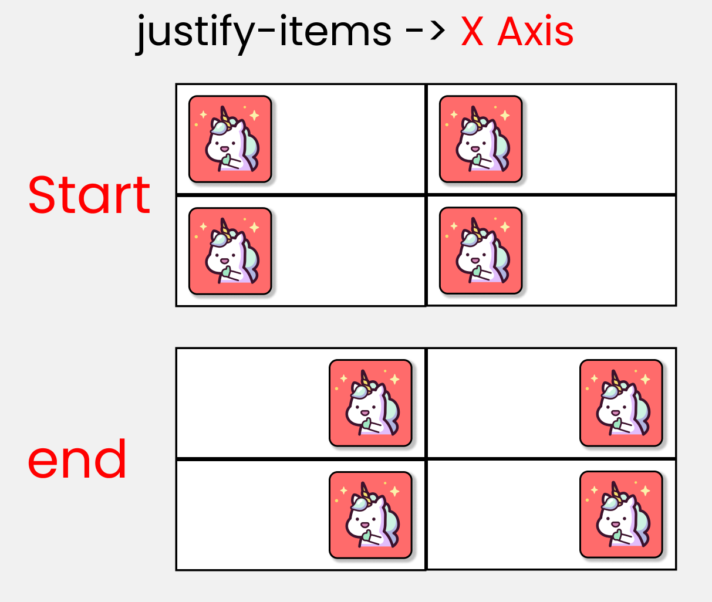

# Responsive Web Design

- [Which to use? Flexbox or Grid?](https://github.com/sakibcy/responsive-web-design/#which-to-use-flexbox-or-grid)
- [Flexbox](https://github.com/sakibcy/responsive-web-design/#flexbox)
- [Grid](https://github.com/sakibcy/responsive-web-design/#grid)
- [Css Units](https://github.com/sakibcy/responsive-web-design/#css-units)
- [Css Articles](https://github.com/sakibcy/responsive-web-design/#css-articles)
- [Resources From](https://github.com/sakibcy/responsive-web-design/#resources-from)

CSS Grid is a multi-dimension layout module, which means that it has columns and rows. Flexbox can lay out its child items either as columns or rows, but not both.


<br />

## Which to use? Flexbox or Grid?

Ask yourself those questions:

- How the component child items are displayed? Inline or as columns and rows?
- How the component is expected to work on various screen sizes?

Most of the time, if the component you are viewing has `all of its child items displayed inline`, then most probably `flexbox is the best solution here`. Consider the following example:


However, if you see columns and rows, then CSS grid is the solution for your case.


### To learn more read this article 👉 [Grid for layout, Flexbox for components](https://ishadeed.com/article/grid-layout-flexbox-components/)


## FlexBox

When you're building a house, you need a blueprint. In the same way, we need a blueprint when we're making websites. And Flexbox is the blueprint.

The Flexbox model allows us to layout the content of our website. Not only that, it helps us create the structures needed for creating responsive websites for multiple devices.

- [Flexbox Architecture](https://github.com/sakibcy/responsive-web-design/#flexbox-architecture)
- [Flexbox Chart](https://github.com/sakibcy/responsive-web-design/#flexbox-chart)

<br />

## Flexbox Architecture


## Flexbox Chart


<br />

## Use flex

For start using flex first declare:

```css
display: flex;
```

<br />

## flex-direction property

This property allows us to set the direction and orientation in which our flex-items should be distributed inside the flex-container.


<br />

## flex-wrap

This property helps you set the number of flex-items you want in a line or row.


<br />

## flex-flow

This is the shorthand for the flex-direction and flex-wrap properties:


<br />

## justify-content property

This property arranges flex-items along the MAIN AXIS inside the flex-container.


<br />

## text-align

Arrange text to left, center, right, start, end


<br />

## align-content property

This property arranges flex-items along the CROSS AXIS inside the flex-container. This is similar to justify-content.
Please note that without the `flex-wrap` property, this property doesn't work. Here's a demo:


<br />

## place-content

This is the shorthand for the align-content and justify-content properties:


<br />

## align-items property

This property distributes Flex-items along the `Cross Axis`.


<br />

## align-self property

This property works on the child classes. It positions the selected item along the Cross Axis.

In total we have 6 values:

- flex-start
- flex-end
- center
- baseline
- stretch
- auto

<br />

## The order property

In addition to reversing the order in which flex items are visually displayed, you can target individual items and change where they appear in the visual order with the `order` property.

The `order` property is designed to lay the items out in ordinal groups. What this means is that items are assigned an integer that represents their group. The items are then placed in the visual order according to that integer, lowest values first. If more than one item has the same integer value, then within that group the items are laid out as per source order.

As an example, I have 5 flex items, and assign order values as follows:

- Source item 1: order: 2
- Source item 2: order: 3
- Source item 3: order: 1
- Source item 4: order: 3
- Source item 5: order: 1

These items would be displayed on the page in the following order:

- Source item 3: order: 1
- Source item 5: order: 1
- Source item 1: order: 2
- Source item 2: order: 3
- Source item 4: order: 3

Items have a number showing their source order which has been rearranged.


<br />

## gap (grid-gap)

The gap CSS property sets the gaps (gutters) between rows and columns. It is a shorthand for row-gap and column-gap.

```css
gap: 10px;
```


<br />

## flex - grow | shrink | wrap | basis properties

The properties will work when we resize the window.

## flex-grow

This property grows the size of a flex-item based on the width of the flex-container.

## flex-shrink

This property helps a flex item shrink based on the width of the flex-container. It's the opposite of flex-grow.


### Please note that flex-grow and flex-shrink work on child classes. So, we will target all our boxes like this:

```css
.box-1 {
  flex-grow: 1;
}
.box-2 {
  flex-grow: 5;
}
.box-1 {
  flex-grow: 1;
}
```

<br />

## flex-basis

This is similar to adding width to a flex-item, but only more flexible. flex-basis: 10em, for example, will set the initial size of a flex-item to 10em. Its final size will be based on the available space, flex-grow, and flex-shrink.

<br />

## flex shorthand

This is the shorthand for the flex-grow, flex-shrink and flex-basis properties combined.


<br />
<br />

# Grid

The Grid items [Contents] are distributed along the main axis and cross axis.

- [Grid Architecture](https://github.com/sakibcy/responsive-web-design/#grid-architecture)
- [Grid Chart](https://github.com/sakibcy/responsive-web-design/#grid-chart)
- [Start using Grid](https://github.com/sakibcy/responsive-web-design/#start-using-grid)
- [Grid Parent](https://github.com/sakibcy/responsive-web-design/#grid-parent)

  - [grid-template-columns](https://github.com/sakibcy/responsive-web-design/#grid-template-columns)
  - [grid-template-rows](https://github.com/sakibcy/responsive-web-design/#grid-template-rows)
  - [grid-template](https://github.com/sakibcy/responsive-web-design/#grid-template)
  - [grid-template-areas](https://github.com/sakibcy/responsive-web-design/#grid-template-areas)
  - [column-gap](https://github.com/sakibcy/responsive-web-design/#column-gap)
  - [row-gap](https://github.com/sakibcy/responsive-web-design/#row-gap)
  - [justify-items](https://github.com/sakibcy/responsive-web-design/#justify-items)
  - [justify-content](https://github.com/sakibcy/responsive-web-design/#justify-content)
  - [align-items](https://github.com/sakibcy/responsive-web-design/#align-items)
  - [align-content](https://github.com/sakibcy/responsive-web-design/#align-content)

- [Grid Children](https://github.com/sakibcy/responsive-web-design/#grid-children)
  - [grid-area](https://github.com/sakibcy/responsive-web-design/#grid-area)

<br />

## Grid Architecture


<br />

## Grid Chart

Grid properties are divided into:

- Parent properties
- Child Properties

Note: The `red colored text` denotes the `shorthand properties`:


## Start using Grid

to use grid on items first declare it:

```css
display: grid;
```

<br />
<br />

# Grid Parent

## grid-template-columns

You use this property to define `the number and width of columns`.

- You can either individually set the width of each column,
- or set a uniform width for all columns using the `repeat()` function.


### Note:

- The pixel values will be an exact measurement. The "auto" keyword will cover the available space.
- If you use `fr (fraction unit)` as a unit of measurement, all the boxes will be equal in size.
- for `repeat()` you can use
  ```css
  grid-template-columns: repeat(3, 1fr);
  ```
  ### or
  ```css
  grid-template-columns: repeat(3, 100px);
  ```

<br />

## grid-template-rows

define the `number and height of rows`. You can either individually set the height of each row, or set a uniform height for all rows using the repeat() function.


<br />

## grid-template


This is the shorthand of 2 properties:

- grid-template-rows
- grid-template-columns

### An example

```css
grid-template-rows: 100px 100px;
grid-template-columns: 200px 200px;

/* The shorthand */
grid-template: 100px 100px / 200px 200px;
```

<br />

## grid-template-areas

use this property to specify the amount of space a grid cell should carry in terms of columns and rows across the parent container.


Call it the blueprint(template) of our layout👇


- `grid-template-areas:`
  The parent property that will create the blueprint
- `grid-area:` the child property that will follow the blueprint.

### First, create the blueprint

Like this 👇 inside the `parent .container` class:

```css
.container {
  display: grid;
  gap: 20px;
  height: 100vh;

  grid-template-areas:
    "A A A A   A A A A   A A A A"
    "B B B B   B B B B   B B C C"
    "B B B B   B B B B   B B C C";
}
```

<br />

## grid-area


### Implement the blueprint

Target all our `child .box-\*` classes and set the values like this

```css
.box-1 {
  grid-area: A;
}
.box-2 {
  grid-area: B;
}
.box-3 {
  grid-area: C;
}
```

<br />

## column-gap

`column-gap` works with `grid-template-columns`


<br />

## row-gap

`row-gap` works with `grid-template-rows`


<br />

## justify-items

You use this property to `position grid-items (children) inside grid containers along the X-Axis [Main Axis]`. The 4 values are 👇
Alt Text




<br />

## justify-content

You use this property to `position your grid [Basically everything] inside the grid container along the X-Axis [Main Axis]`. The 7 values are 👇


<br />

## align-items

use this property to `position grid-items (children) inside the grid container along the Y-Axis [Cross Axis]`.

 

 <br />

## align-content

use this property to `position our grid [Basically everything] inside the grid container along the Y-Axis [Cross Axis]`.


<br />

## place-items

short form of

- justify-items
- align-items

## place-content

short form of

- justify-content
- align-content

<br />

# Grid Children


The illustration below 👇 shows the start and end points of rows and columns of a single cell.


## grid-column-start - grid-column-end

join multiple Columns together\
Write this code in your CSS:

```css
.container {
  display: grid;
  gap: 20px;
  height: 100vh;

  grid-template-columns: repeat(12, 1fr);
  grid-template-rows: repeat(12, 1fr);
}
```

The result looks like this:


As we are dealing with child properties, we need to target our `.box-*` classes like this:

```css
.box-1 {
}
.box-2 {
}
.box-3 {
}
.box-4 {
}
```

The default scale of every `.box-*` class is:

```css
grid-column-start: 1;
grid-column-end: 10;

/* The shorthand -> */
grid-column: 1 / 10;
/* or */
grid-column: span 10;
```

The result looks like this: 👇


## grid-column

short form of

- grid-column-start
- grid-column-end

```css
grid-column-start: 1;
grid-column-end: 2;

/* The shorthand -> */
grid-column: 1 / 10;
/* or */
grid-column: span 10;
```

## grid-row-start - grid-row-end

use these two properties to join multiple `ROWS` together.

```css
.box-1 {
  grid-row-start: 1;
  grid-row-end: 11;

  /* shorthand */
  grid-row: 1/11;
}
```


<br />

## Media Queries

<br/>
<br>
<br>

# Css Units

### REM, EM, VW, VH are relative units

#### Font using the REM unit


#### pixels are absolute units.

👇 Notice that the font size of 50px doesn't change when we resize the window.


## REM Unit

The REM unit depends on the `root element [the HTML element]`. Here's an image to show you how it works:👇


## How to change the root font-size

By default `root fon-size` is `16px`. But you can change it 👇

```css
html {
  font-size: 40px; /* Change here */
}

.text {
  font-size: 1rem;
}
```

## How to Make Responsive Websites with REM Units

Write your styles in rem units instead of the pixels and change the root elements at different breakpoints using media queries.

```css
// large screen

@media (max-width: 1400px) {
  html {
    font-size: 25px;
  }
}

// Tablet screen

@media (max-width: 768px) {
  html {
    font-size: 18px;
  }
}

// Mobile screen

@media (max-width: 450px) {
  html {
    font-size: 12px;
  }
}
```

### Now, set the .text class to 3 rem units, like this:

```css
.text {
  font-size: 3rem;
}
```

And here's the result: 👇


Here are the calculations:

- For the large screen -> 3 rem \* 25px = 75px
- For tablet screen -> 3 rem \* 18px = 54px
- For mobile screen -> 3 rem \* 12px = 36px
- Default setting -> 3rem \* 16px = 48px

## EM Units

### Don't use the EM unit 😵❌

Using the EM unit is not worth the effort because:

- you have a high chance of making a calculation error
- you have to write a lot of code in media queries while trying to make the website responsive on all screen sizes
- it's too time-consuming.

The EM unit is the same as the REM unit but it depends on the parent font size. Here's a demo. 👇

Note: make sure you remove all the media queries.

```css
html {
  font-size: 16px;
}

.text {
  font-size: 3em;
}

/** Calculations
  font-size should be 
  3 em * 16px = 48px
**/
```

Now, let's try adding 3em padding to the .text class.

```css
html {
  font-size: 16px;
}

.text {
  font-size: 3em;
  padding: 3em;
}

/** Calculations
text    => 3em * 16px = 48px
padding => 3em * 3em * 16px = 144px
**/
```

Instead of being 48px of padding, we are getting 144px padding. As you can see, it is getting multiplied by the previous number.


Here's the computed part from the developer console: 👇


## VW unit - viewport width

It works like the percentage unit. Specifying `50vw` is equivalent to occupying `50% of entire visible screen width`

```css
.text {
  display: none;
}

.box {
  width: 50vw;

  height: 300px;
  /* display: none; */
}
```

If you look carefully, you can see that 50vw means 50%, which will cover half of the entire screen width.


resizing box which is 50vw in size. It is taking 50% of entire screen even if we resize the window.


## VH unit - viewport height

It works like the percentage unit as well. Specifying `50vh` is equivalent to `occupying 50% of entire visible screen height`

```css
.text {
  display: none;
}

.box {
  width: 300px;

  height: 50vh;
  /* display: none; */
}
```

And here's the result: 👇


As you can see, it will always cover that much space even if we resize the window.


# Css Articles

- [Learn CSS Units – Em, Rem, VH, and VW with Code Examples ✨✨](https://www.freecodecamp.org/news/learn-css-units-em-rem-vh-vw-with-code-examples/)
- [Flexbox Tutorial with Flexbox Properties Cheat Sheet 🎖️](https://www.freecodecamp.org/news/css-flexbox-tutorial-with-cheatsheet/)
- [Grid for layout, Flexbox for components](https://ishadeed.com/article/grid-layout-flexbox-components/)
- [CSS Notes for Professionals book](https://goalkicker.com/CSSBook/)

# Resources from

- [Joy Shaheb](https://www.freecodecamp.org/news/author/joy/)
- [Ahmad Shadeed](https://ishadeed.com/article/grid-layout-flexbox-components/)
