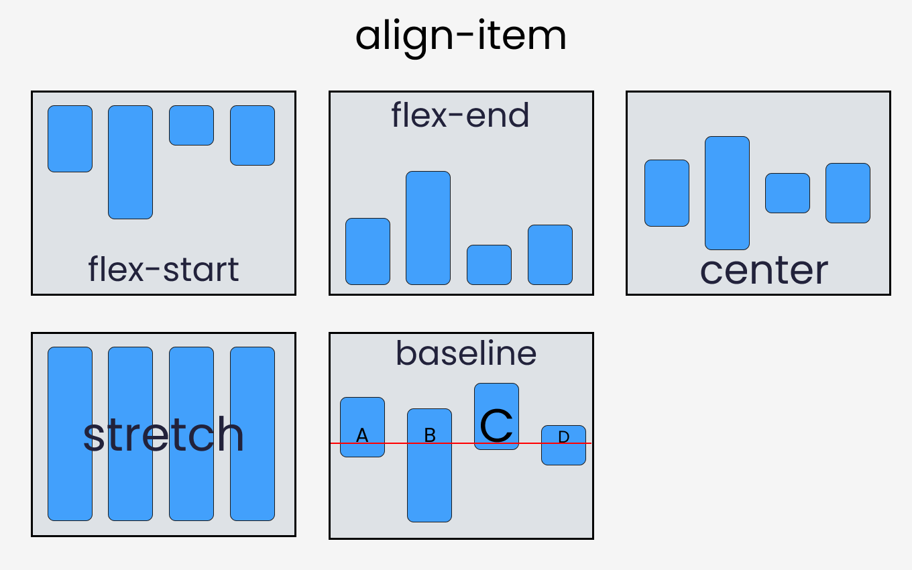

# Responsive Web Design
* [Css Units](https://github.com/sakibcy/responsive-web-design#css-units)
* [Flexbox](https://github.com/sakibcy/responsive-web-design#flexbox)
* [Css Articles](https://github.com/sakibcy/responsive-web-design#css-articles)


## Css Units


## FlexBox
When you're building a house, you need a blueprint. In the same way, we need a blueprint when we're making websites. And Flexbox is the blueprint.

The Flexbox model allows us to layout the content of our website. Not only that, it helps us create the structures needed for creating responsive websites for multiple devices. 
* [Flexbox Architecture](https://github.com/sakibcy/responsive-web-design#flexbox-architecture)
* [Flexbox Chart](https://github.com/sakibcy/responsive-web-design#flexbox-chart)


## Flexbox Architecture


## Flexbox Chart


## flex-direction property
This property allows us to set the direction and orientation in which our flex-items should be distributed inside the flex-container.


## justify-content property
This property arranges flex-items along the MAIN AXIS inside the flex-container.


## align-content property
This property arranges flex-items along the CROSS AXIS inside the flex-container. This is similar to justify-content.
Please note that without the ```flex-wrap``` property, this property doesn't work. Here's a demo:


## place-content
This is the shorthand for the align-content and justify-content properties:


## align-items property
This property distributes Flex-items along the ```Cross Axis```.



## align-self property
This property works on the child classes. It positions the selected item along the Cross Axis.

In total we have 6 values:
* flex-start
* flex-end
* center
* baseline
* stretch
* auto

## The order property

In addition to reversing the order in which flex items are visually displayed, you can target individual items and change where they appear in the visual order with the ```order``` property.

The ```order``` property is designed to lay the items out in ordinal groups. What this means is that items are assigned an integer that represents their group. The items are then placed in the visual order according to that integer, lowest values first. If more than one item has the same integer value, then within that group the items are laid out as per source order.

As an example, I have 5 flex items, and assign order values as follows:

* Source item 1: order: 2
* Source item 2: order: 3
* Source item 3: order: 1
* Source item 4: order: 3
* Source item 5: order: 1

These items would be displayed on the page in the following order:

* Source item 3: order: 1
* Source item 5: order: 1
* Source item 1: order: 2
* Source item 2: order: 3
* Source item 4: order: 3

Items have a number showing their source order which has been rearranged.


You can play around with the values in this live example below and see how that changes the order. Also, try changing flex-direction to row-reverse and see what happens — the start line is switched so the ordering begins from the opposite side.

## gap (grid-gap)

The gap CSS property sets the gaps (gutters) between rows and columns. It is a shorthand for row-gap and column-gap.


## Css Articles
* [Learn CSS Units – Em, Rem, VH, and VW with Code Examples ✨✨](https://www.freecodecamp.org/news/learn-css-units-em-rem-vh-vw-with-code-examples/)
* [Flexbox Tutorial with Flexbox Properties Cheat Sheet 🎖️](https://www.freecodecamp.org/news/css-flexbox-tutorial-with-cheatsheet/)
